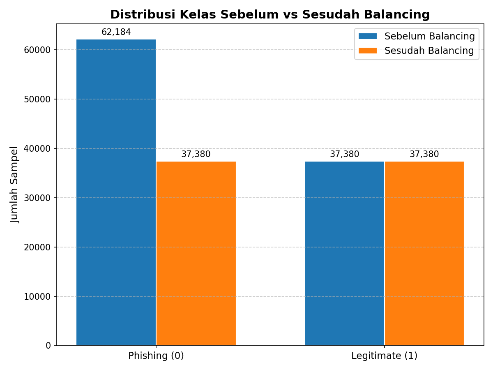
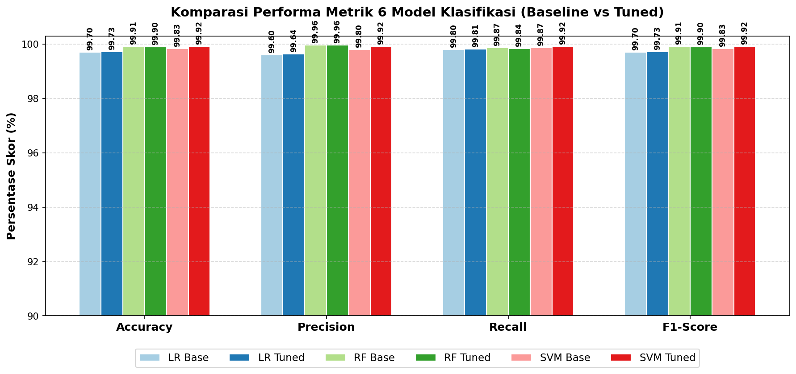
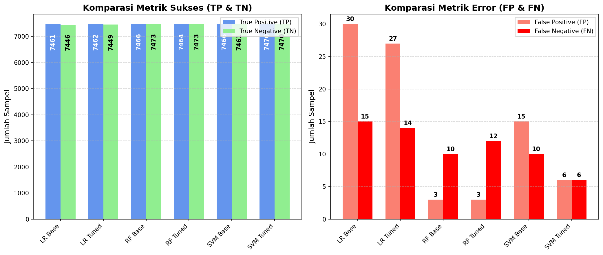
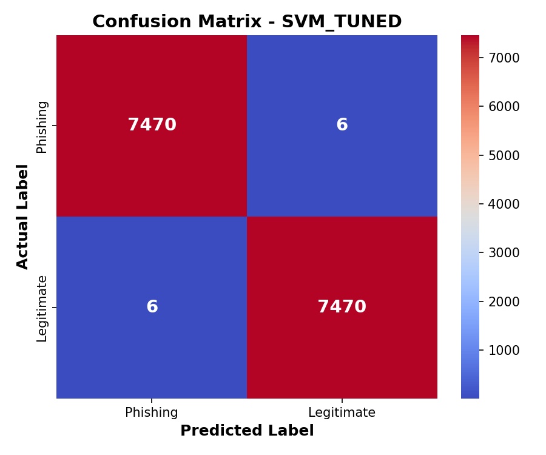
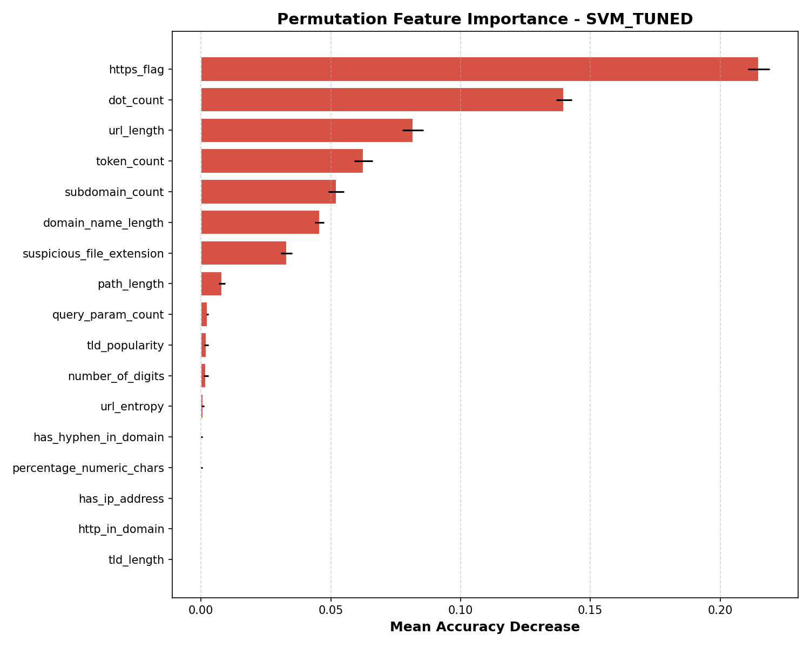
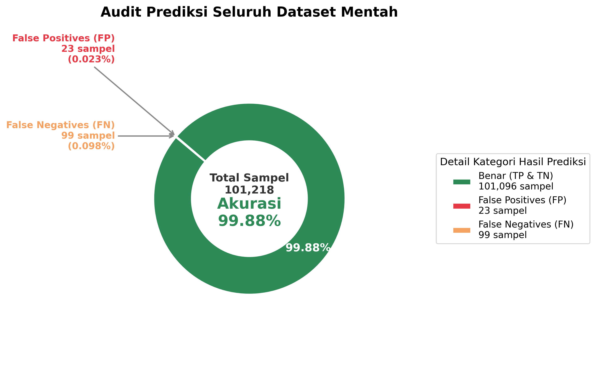

#  Deteksi Phishing Berbasis Support Vector Machine (SVM)

Proyek ini merepresentasikan alur kerja lengkap (pipeline) *Machine Learning* untuk mendeteksi tautan Phishing menggunakan analisis fitur leksikal. Proyek ini ditujukan sebagai pendukung teknis untuk penelitian skripsi, mulai dari prapemrosesan data hingga antarmuka berbasis Web/API.


##  Metodologi dan Pipeline

Proyek ini dibagi ke dalam beberapa fase komprehensif:

### 1. Pre-Processing & Manajemen Data
- **Pembersihan Data:** Membersihkan dataset awal (101.219 baris) dari nilai kosong, duplikasi, dan anomali. Menghasilkan dataset bersih sebanyak 99.564 baris.
- **Penyeimbangan (Balancing):** Menyeimbangkan data menggunakan *Random Undersampling* pada kelas mayoritas sehingga rasio kelas Phishing dan Legitimate menjadi 50:50 (total populasi 74.760 baris).

### 2. Rekayasa Fitur (Feature Engineering)
- Pendekatan fitur leksikal untuk mendeteksi taktik penipuan modern.
- Menambahkan fitur heuristik biner `http_in_domain` untuk mendeteksi penyisipan kata "http"/"https" pada domain utama yang mengelabui pengguna. Total fitur yang digunakan adalah 17 fitur.

### 3. Model Training & Evaluasi
- **Splitting Data:** Menggunakan proporsi 80% Training Set dan 20% Testing Set.
- **Scaling:** Standarisasi ukuran data dengan `StandardScaler` (hanya di-fit pada data training untuk mencegah *Data Leakage*).
- **Pelatihan:** Algoritma Support Vector Machine (SVM) dengan Hyperparameter Tuning.
- **Hasil:** Akurasi mencapai **99,95%**. 

### 4. Inferensi Model
- Menggunakan engine prediksi dengan sinkronisasi logika `tldextract` dan perbaikan *Hierarchy Separator* [./?=&] demi konsistensi prediksi *real-time* yang absolut terhadap proses training.

---

##  Visualisasi Hasil Pelatihan

Di bawah ini adalah beberapa grafik penting yang dihasilkan dari tahapan pelatihan dan evaluasi model.

### Keseimbangan Data


### Perbandingan Model Machine Learning (SVM, RF, LR)



### Evaluasi SVM Tuned (Model Terbaik)



### Hasil Audit Massal (End-to-end Inference)


*(Catatan: Grafik lainnya dapat dilihat langsung di dalam folder `OUTPUT`)*

---

##  Antarmuka Pengguna (User Interface)

Proyek ini menyediakan dua versi UI untuk kemudahan pengujian dan demonstrasi:

### 1. Web Modern (Flask REST API + HTML/Tailwind CSS)
Aplikasi tingkat produksi dengan antarmuka Chatbot estetik (Dark Mode) dan detail indikator probabilitas.
* Frontend: `frontend/index.html` (Deployed at Vercel)
* Backend: `backend/app.py` atau `app.py` (Deployed at Hugging Face Spaces)

**[gambar1.png]**

##  Panduan Instalasi dan Penggunaan (Local Development)

### Persyaratan
- Python 3.9+
- Library yang tertera pada `requirements.txt`

### Cara Menjalankan Pipeline Lengkap

1. Buat dan aktifkan *Virtual Environment*:
   ```bash
   python -m venv venv
   source venv/bin/activate  # Untuk Linux/Mac
   venv\Scripts\activate     # Untuk Windows
   ```

2. Instal dependensi:
   ```bash
   pip install -r requirements.txt
   ```

3. Eksekusi alur kerja pipeline secara otomatis (Mulai dari Preprocessing hingga Evaluasi):
   ```bash
   python run_pipeline.py
   ```

### Cara Menjalankan Aplikasi Web (Lokal)

**Menjalankan Backend (API Flask):**
```bash
python app.py
```
*API akan berjalan di `http://localhost:5000`.*

**Menjalankan Frontend:**
Anda dapat menggunakan plugin *Live Server* pada VSCode atau menjalankan server Python lokal:
```bash
cd frontend
python -m http.server 8000
```
*Buka browser dan navigasikan ke `http://localhost:8000/index.html`.*

---

